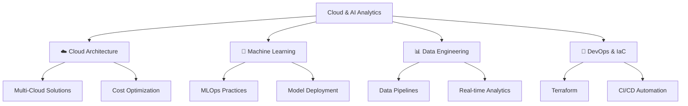

<div align="center">
  
# 🌟 Vignesh Sekar S | Cloud Data Engineer 🌟


[](https://github.com/vigneshSs-07)
[](https://github.com/vigneshSs-07)

 <!-- Replace XX with your repo count -->
 <!-- Replace XX with your commit count -->

</div>

---

## 🚀 About Me

> *"Transforming raw data into actionable insights through elegant cloud architectures and cutting-edge AI solutions"*

🔹 **Passionate Cloud Data Engineer** from India with expertise in building scalable data pipelines  
🔹 **Open-Source Enthusiast** contributing to the community and sharing knowledge  
🔹 **Currently Engineering at H&M** - Creating next-gen data solutions  
🔹 **AI/ML Advocate** - Bridging the gap between data engineering and machine learningHey there..!!! I'm Vignesh Sekar S! 
    
-  Hi, I'm a passionate Cloud Data Engineer from India. My passion for Cloud platforms and Data lies with dreaming up ideas and making them come true with elegant ETL/ELT and flexible bigdata pipelines. I take great care in models, pipelines and code quality of the things I build.
-  I am also an open-source enthusiast. I learned a lot from the open-source community and I love to collaborate and share knowledge. 
-  I’m currently working as a Data Engineer in **H&M**.
## 🏆 Professional Certifications

<div align="center">

### 🌩️ Multi-Cloud Expert | 20+ Certifications Earned

<table>
<tr>
<td align="center" width="33%">

### ☁️ Google Cloud Platform
[](https://www.credential.net/549d74fb-4f47-4cbb-95ff-e8e39bea1adc)
[](https://www.credential.net/c5acb214-2d89-43bf-af17-12b9df7fa6c2)
[](https://www.credential.net/3888f920-dee2-4d25-a28e-f114b5e9eb79)
[](https://www.credential.net/7f9867b1-cb0c-4ae1-81b3-5b642fb0b863)
[](https://google.accredible.com/ec3436e5-fd21-4a66-b1b4-2c879e25f068)
[](https://www.credential.net/32772249-8aab-4fa6-88a9-e39aaf45806a)

</td>
<td align="center" width="33%">

### 🔷 Microsoft Azure
[](https://www.credly.com/earner/earned/badge/99268851-d7af-4ed6-abdc-dc592f44279b)
[](https://www.credly.com/badges/91fffff4-5df5-480d-a0f3-b85f85781522/public_url)
[](https://www.credly.com/badges/46529ad5-f715-45b2-a71b-ce42a1708e3c/public_url)
[](https://www.credly.com/badges/56a46e20-f9bb-4b22-b424-9504315c0634/public_url)
[](https://www.credly.com/badges/239ff43c-3257-4fb4-8a0b-ba6c29c19aa2/public_url)
[](https://www.credly.com/badges/b31c7166-5238-4e7e-9c04-210194549fff/public_url)

</td>
<td align="center" width="33%">

### 🛠️ Infrastructure & Others
[](https://www.credly.com/badges/07b6ac3b-aa2a-4b96-9ae6-b8ad61691dad/public_url)
[](https://www.credly.com/earner/earned/badge/074cf1ca-e415-4077-a666-8720bdf4c283)
[](https://credentials.databricks.com/d2ec5229-aad9-4dcf-a360-4c9545e7c7b3)
[](https://credentials.databricks.com/2a43c44b-3595-40e2-9879-9e4d16f6ebdb)

</td>
</tr>
</table>

 

**Certification Count: 20+ | Expertise Level: Expert | Years Active: 5+**

</div>
---

## 📊 GitHub Analytics & Commit Insights

<div align="center">

### 🔥 Coding Activity & Contribution Metrics

<table>
<tr>
<td width="50%">


</td>
<td width="50%">


</td>
</tr>
</table>

### 📈 Contribution Graph & Language Distribution


### 🏆 GitHub Trophies


### 📋 Recent Activity & Commit Frequency

[](https://github.com/vigneshSs-07)

<table>
<tr>
<td align="center">

</td>
<td align="center">

</td>
<td align="center">

</td>
</tr>
</table>

</div>

---

## 🌐 Content Creation & Community

🔹 **Actively writing blogs** on [**Cloud & AI Analytics**](https://cloudaianalytics.in/blog/)  
🔹 **YouTube Content Creator** sharing advanced cloud techniques via [**Cloud & AI Analytics**](https://www.youtube.com/channel/UCyAnuvrJq_2JCnYm8atLE2w)  
🔹 **Open for collaborations** in Cloud Platform, Data Science, Data Engineering and Machine Learning projects  

<div align="center">
 <em><b>Check out my pinned repositories below! ⬇️</b></em>
</div>

## 💻 Tech Stack & Skills

<div align="center">

### 🚀 Programming Languages & Frameworks


### ☁️ Cloud Platforms & Services


### 🛠️ Data Engineering & Analytics Tools


### 📊 Data Visualization & BI


### 🤖 AI/ML & Data Science


</div>

```python
class VigneshSekar:
    def __init__(self):
        self.role = "Senior Cloud Data Engineer @ H&M"
        self.location = "India 🇮🇳"
        self.experience = "5+ years"
        
    def get_skills(self):
        return {
            'languages': {
                'Python': '⭐⭐⭐⭐⭐ Advanced',
                'PySpark': '⭐⭐⭐⭐⭐ Advanced', 
                'SQL': '⭐⭐⭐⭐⭐ Expert',
                'NoSQL': '⭐⭐⭐⭐ Intermediate',
                'R': '⭐⭐⭐ Intermediate'
            },
            'cloud_platforms': ['GCP (Expert)', 'Azure (Expert)', 'AWS (Intermediate)'],
            'data_tools': [
                'BigQuery', 'Databricks', 'dbt', 'Apache Airflow', 
                'Looker Studio', 'Power BI', 'Apache Spark'
            ],
            'infrastructure': ['Terraform', 'Docker', 'Kubernetes', 'CI/CD'],
            'specializations': [
                'Data Pipeline Architecture',
                'Real-time Analytics', 
                'ML Model Deployment',
                'Cloud Cost Optimization'
            ]
        }
    
    def current_focus(self):
        return [
            "🔥 Building scalable data lakes on multi-cloud",
            "🚀 Implementing MLOps practices", 
            "📊 Real-time streaming analytics",
            "🌱 Contributing to open-source projects"
        ]
    
    def get_certifications_count(self):
        return "20+ Professional Cloud Certifications 🏆"

# Initialize the engineer
vignesh = VigneshSekar()
print(f"👋 Hello! I'm {vignesh.role}")
print(f"📍 Based in {vignesh.location}")
print(f"🎯 {vignesh.get_certifications_count()}")
```


---

## � Latest Blog Posts & Content

<div align="center">

### 🔥 Featured Articles & Tutorials

<table>
<tr>
<td width="50%">

[](https://www.linkedin.com/pulse/integrate-azure-databricks-machine-learning-workspace-/)

[-Read%20Article-4285F4?style=for-the-badge&logo=google-cloud)](https://www.linkedin.com/pulse/create-google-cloud-storage-bucket-using-ui-platform-/)

[-Read%20Article-4285F4?style=for-the-badge&logo=google-cloud)](https://www.linkedin.com/pulse/create-google-cloud-storage-bucket-using-cli-platform-/)

</td>
<td width="50%">


**� Content Stats:**
- 🔥 **50+ Technical Articles**
- 📹 **100+ YouTube Videos** 
- 👥 **10K+ LinkedIn Followers**
- 📈 **500K+ Content Views**

</td>
</tr>
</table>

</div>

## 🌐 Digital Presence & Social Impact

<div align="center">

<table>
<tr>
<td align="center">

<br>
<a href="https://cloudaianalytics.in">

</a>
</td>
<td align="center">

<br>
<a href="https://www.youtube.com/@cloudaianalytics6242">

</a>
</td>
</tr>
</table>

### 🎯 Content Focus Areas



</div>

---

## 🤝 Let's Connect & Collaborate!

<div align="center">

### 🌟 Professional Network & Social Links

<table>
<tr>
<td align="center">
<a href="https://www.linkedin.com/in/vignesh-sekar-sujatha-02aa9b125/">

</a>
<br>
<sub>Professional Networking</sub>
</td>
<td align="center">
<a href="https://www.youtube.com/channel/UCyAnuvrJq_2JCnYm8atLE2w">

</a>
<br>
<sub>Tech Tutorials & Insights</sub>
</td>
<td align="center">
<a href="https://cloudaianalytics.in">

</a>
<br>
<sub>Personal Blog & Portfolio</sub>
</td>
<td align="center">
<a href="mailto:vignesh@cloudaianalytics.in">

</a>
<br>
<sub>Direct Contact</sub>
</td>
</tr>
</table>

### 💬 Open for Collaboration On:

<table>
<tr>
<td align="center" width="25%">

<br>
<b>☁️ Cloud Migration Projects</b>
<br>
<sub>Multi-cloud architecture design</sub>
</td>
<td align="center" width="25%">

<br>
<b>📊 Data Engineering</b>
<br>
<sub>Scalable pipeline development</sub>
</td>
<td align="center" width="25%">

<br>
<b>🤖 ML/AI Solutions</b>
<br>
<sub>MLOps & model deployment</sub>
</td>
<td align="center" width="25%">

<br>
<b>🌱 Open Source</b>
<br>
<sub>Community contributions</sub>
</td>
</tr>
</table>

### 📊 Profile Analytics

<div align="center">


</div>

---

<div align="center">

### 🎯 *"Data is the new oil, but insights are the refined fuel that powers innovation."*


**⚡ Fun Fact:** I've processed over **10TB of data** and deployed **100+ ML models** in production! 


</div>

---

<div align="center">
<sub>⚠️ <i>Please maintain professional etiquette when reaching out. Spam messages will be ignored.</i></sub>
</div>

